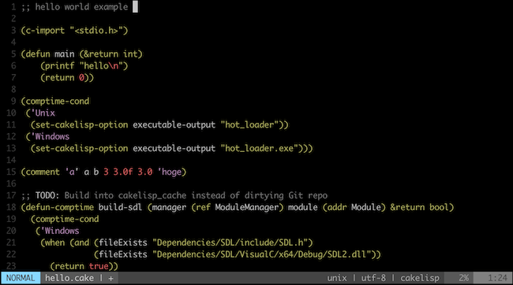

# cakelisp.vim

Syntax files for [Cakelisp](https://macoy.me/code/macoy/cakelisp) in Vim (**Unofficial**).

## Screenshots



## Install with Vundle

```vim
Plugin 'git://github.com/funatsufumiya/cakelisp.vim.git'
```

## Install with vim-plug

```vim
Plug 'https://github.com/funatsufumiya/cakelisp.vim.git'
```

## Build

- Install [Janet](https://janet-lang.org/)

```bash
$ make # This execute `janet scripts/gen.janet` to generate syntax/cakelisp.vim
```

## TODOs

- Single quote string (not to be confused with keyword symbol, ex: `'Unix` and `'\"'`)
- Sort out special forms, macros, and functions

## Acknowledgements

This repository was created as a fork from [janet-lang/janet.vim](https://github.com/janet-lang/janet.vim) at [commit dc14b02](https://github.com/janet-lang/janet.vim/commit/dc14b02f2820bc2aca777a1eeec48627ae6555bf)
